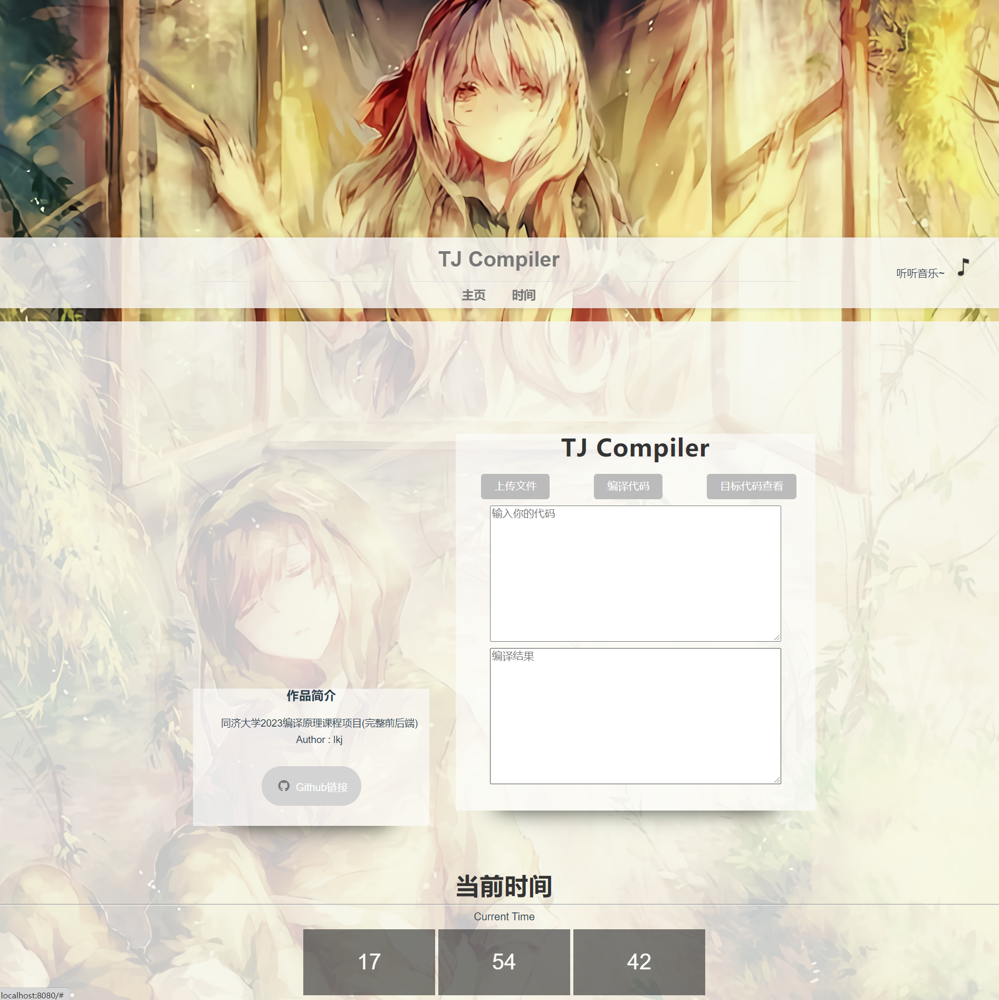
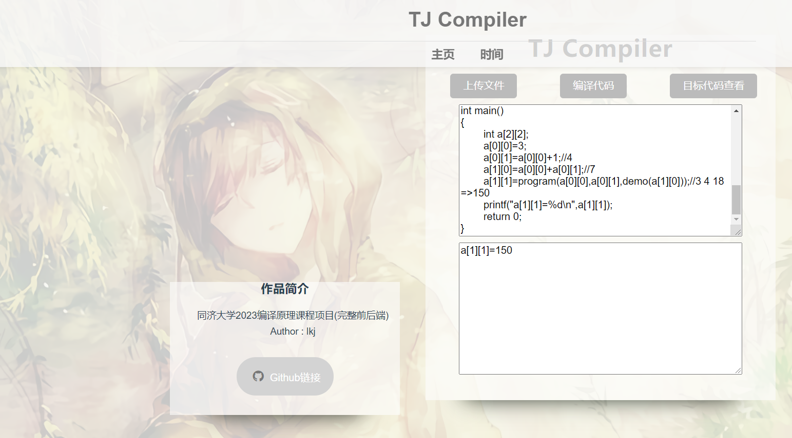
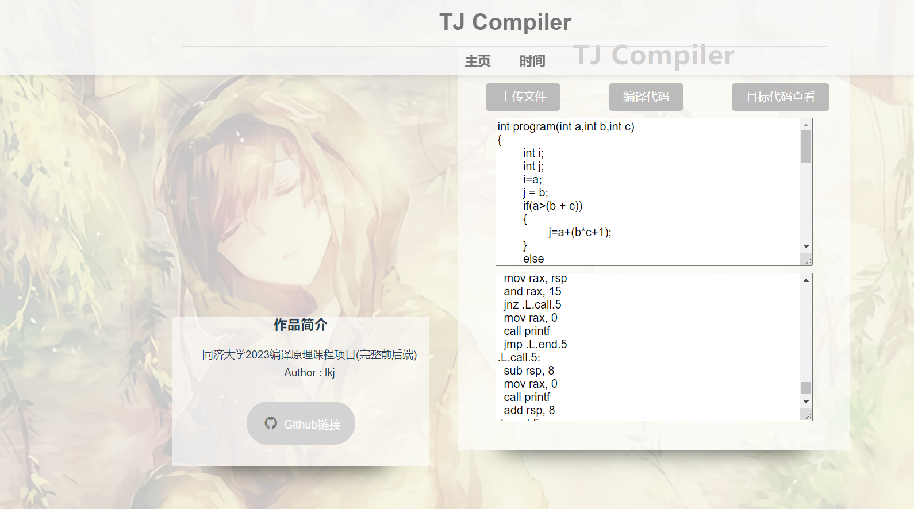
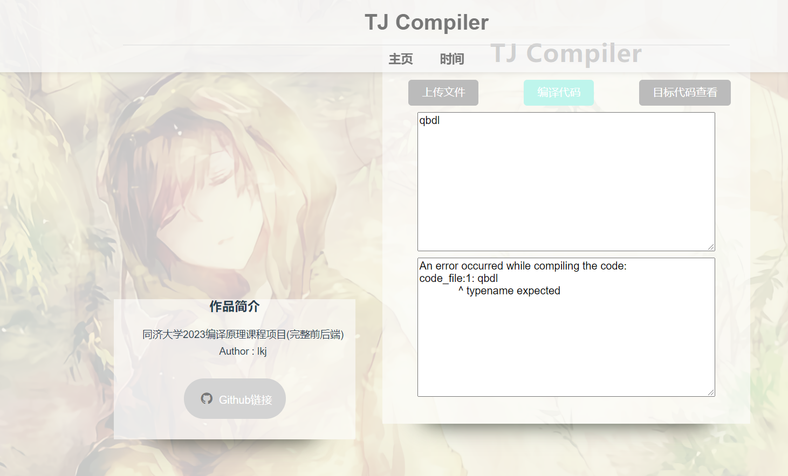

# TJ-Compiler-Full-Version
同济大学2023编译原理课程项目（完整前后端）

运行操作系统：Linux（编译器部分需要Linux的一些库）

该项目对应纯编译器部分：https://github.com/qbdl/TJ-Compiler

### 一、使用说明

#### 1、下载代码

```powershell
git clone https://github.com/qbdl/TJ-Compiler-Full-Version.git
cd TJ-Compiler-Full-Version
```

#### 2、安装前端依赖项

```powershell
cd FrontEnd
npm install
```


#### 3、运行前端

```powershell
npm run serve
```

#### 4、运行后端

```powershell
cd BackEnd
python main.py
```


#### 补充：Ubuntu系统安装npm

使用 nvm (Node Version Manager) 来管理你的 Node.js 版本

```powershell
curl -o- https://raw.githubusercontent.com/nvm-sh/nvm/v0.35.3/install.sh | bash
```

安装完成后，重启你的终端，然后使用 nvm 安装 Node.js：

```
nvm install node
```

查看版本

```
node -v
npm -v
```

也可以选择安装特定版本，比如Node.js v14.17.1

```
nvm install 14.17.1
nvm use 14.17.1
```

设置默认版本

```
nvm alias default 14.17.1
```


### 二、效果展示








